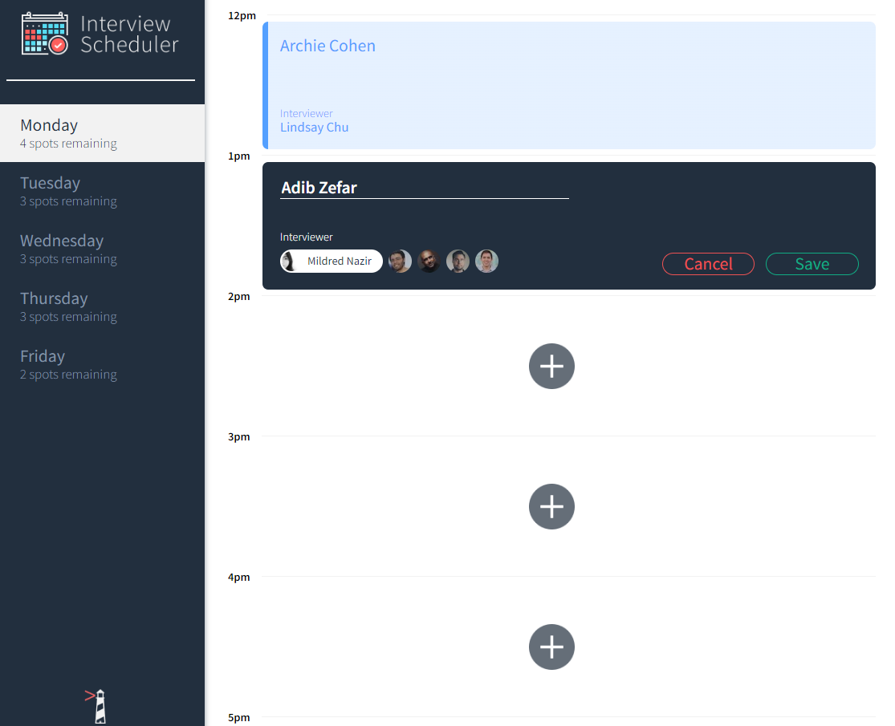

# Interview Scheduler
Interview scheduler is a single-page React application that students create in weeks 17-21 at Lighthouse Labs. The application allows users to schedule interviewers from Monday - Friday from 12:00 - 17:00. Users can also change the interviewer, edit their name or cancel the interview.

Data is stored through use of an API which can be found [here](https://github.com/lighthouse-labs/scheduler-api)

## Screenshots

### Homepage



## Setup

- Install dependencies with `npm install`.
- Set up API by following the README [here](https://github.com/lighthouse-labs/scheduler-api)
- `npm start` on both the API and the interview scheduler

## Running Webpack Development Server

```sh
npm start
```

## Running Jest Test Framework

```sh
npm test
```

## Running Storybook Visual Testbed

```sh
npm run storybook
```
